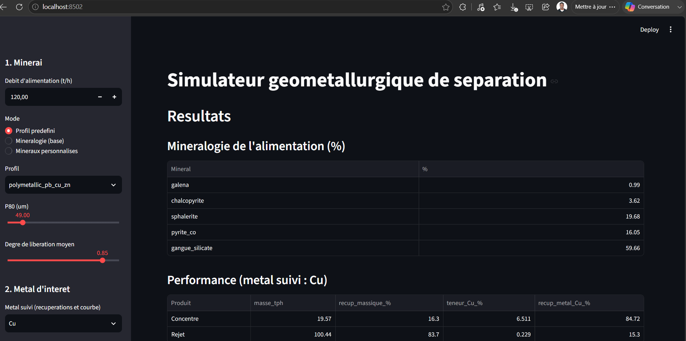
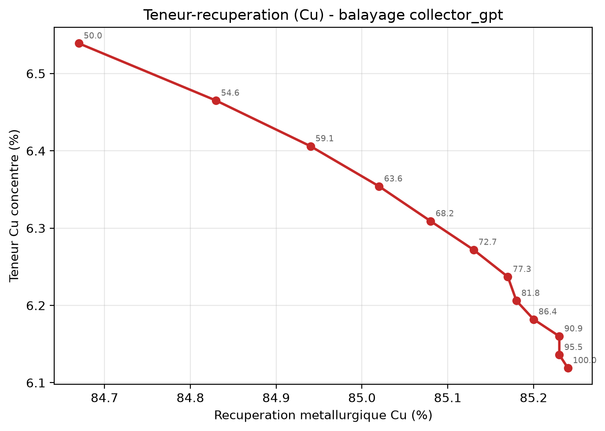
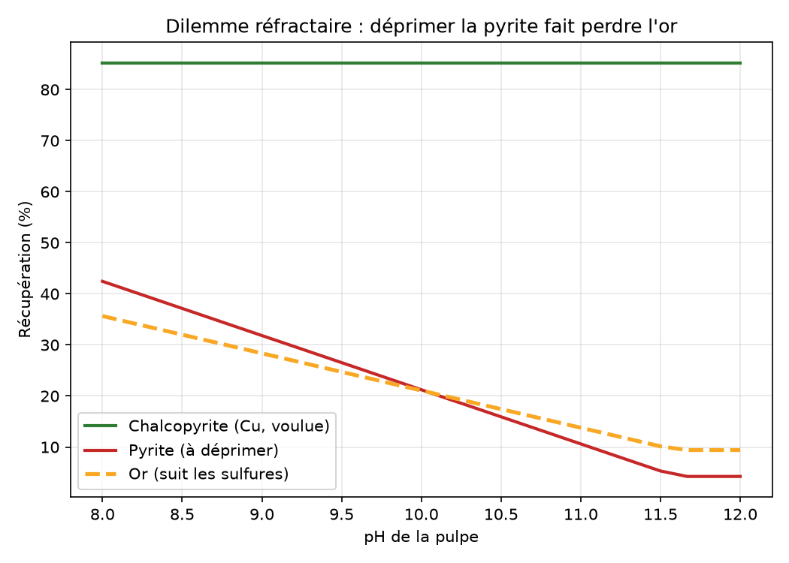
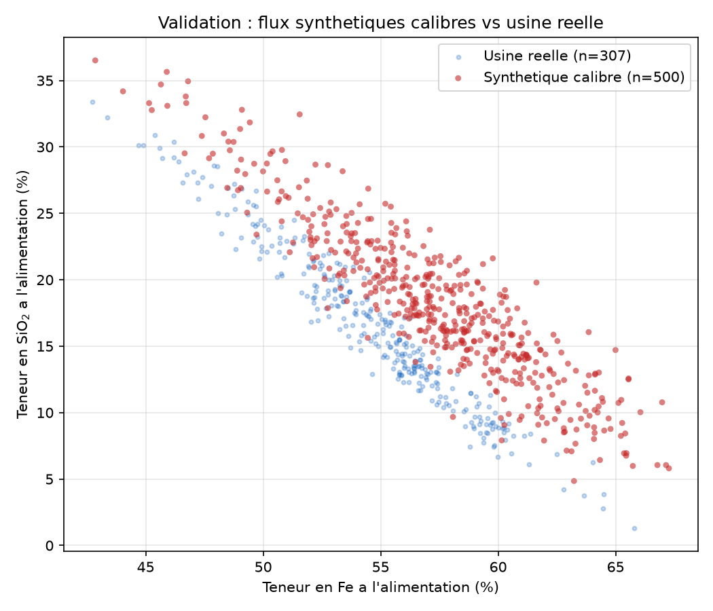
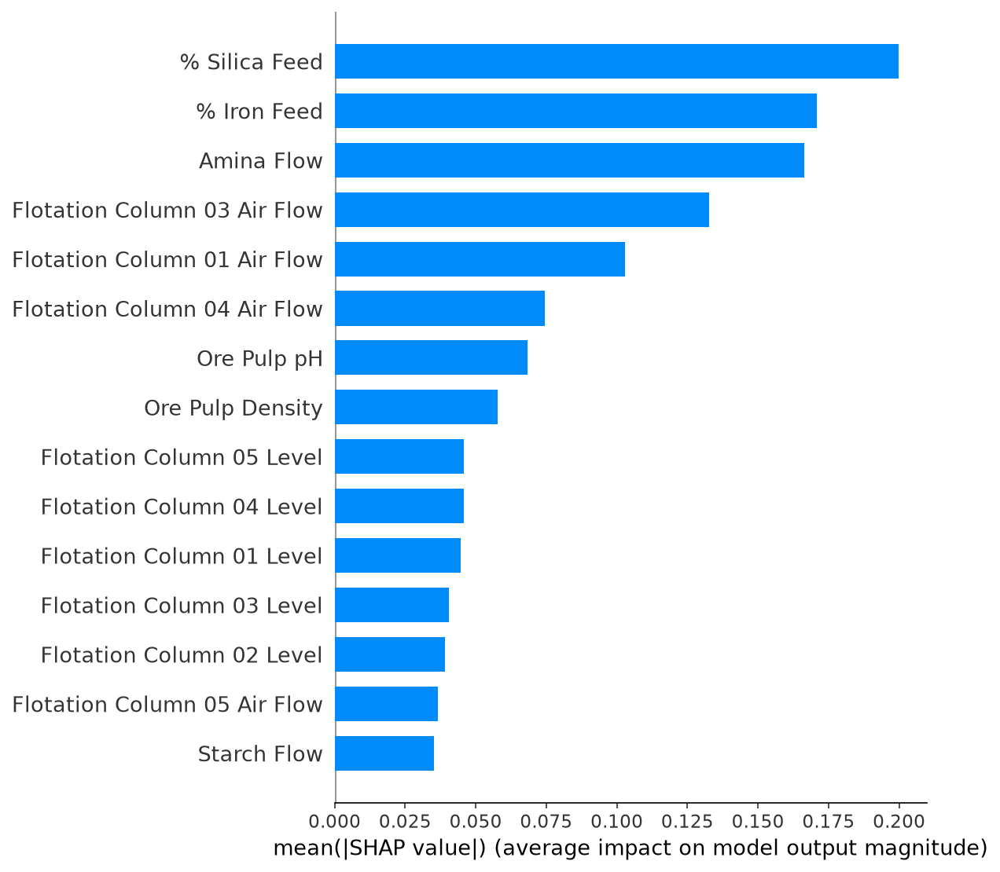

# Geometallurgical Separation Simulator

**A physics-based simulator that predicts mineral separation performance from ore mineralogy cross-validated against a data-driven machine-learning model trained on real plant data.**

The tool takes an ore's *mineralogy* (the minerals present and their proportions) and a chosen *process route* (gravity, magnetic, or flotation separation, single-stage or multi-stage circuits), then predicts the resulting concentrates, tailings, grades, and recoveries. It ships with an interactive web interface, and its predictions are checked two ways: against the physics of mineral processing, and against a machine-learning model that learns separation behaviour directly from a real iron-ore flotation plant dataset.

---

## Highlights

</p>
<p align="center">
  
</p>
<p align="center">
  <em>The web interface: pick an ore, a route and its settings, and get concentrates, recoveries and grades with grade-recovery and kinetics curves derived from the model.</em>
</p>
<p align="center">
  
</p>
<p align="center">
  <em>Grade-recovery curve for copper, swept over collector dose: the fundamental trade-off recovering more metal dilutes the concentrate.</em>
</p>
<p align="center">
  
  
</p>
<p align="center">
  <em>Left: the refractory-gold dilemma depressing pyrite to clean the concentrate also loses the gold locked inside it. Right: synthetic feed calibrated against a real iron plant (307 distinct hourly measurements).</em>
</p>

<p align="center">
  
</p>
<p align="center">
  <em>SHAP feature importance from the data-driven model. With no physics coded in, the model rediscovers the true levers of reverse iron flotation feed silica/iron, amine flow (the collector), air and pH.</em>


---

## What the simulator does

- **Generates realistic synthetic ores** from mineralogical profiles, deriving chemical assays from stoichiometry (mineralogy drives chemistry, not the other way around).
- **Separates ore by three physical routes**, each governed by its own physics:
  - *Gravity* (shaking table, spiral, Falcon) partition by density.
  - *Magnetic* (LIMS / WHIMS) partition by magnetic susceptibility.
  - *Flotation* (direct and reverse) first-order kinetics, pH-dependent pyrite depression, differential depression/activation of sphalerite.
- **Builds configurable differential circuits** multi-stage flotation described as data (Cu→Zn, Pb→Cu→Zn, or any user-composed sequence), where each stage names the minerals to depress or activate.
- **Handles user-defined minerals** any real mineral outside the built-in base can be added with its physical properties (density, magnetic category, floatability) and XRF-style chemistry, and used in both single separations and circuits.
- **Produces the classic geometallurgical curves** grade–recovery and flotation kinetics, derived directly from the model (not imported).
- **Runs in the browser** a Streamlit interface exposes all of the above with sliders, editable tables, and live plots. 


## A two-pronged approach

The project deliberately validates the same phenomena two independent ways, and their agreement is the point.

**1. The physics model** encodes domain knowledge: amine floats silica, pH controls selectivity, dense minerals report to gravity concentrate, and so on. It is *phenomenological* right in the direction and order of magnitude of its trends, not calibrated to specific assays.

**2. The data-driven model** (XGBoost) learns to predict concentrate silica from a real iron-plant dataset, with no physics supplied. Careful methodology avoids the classic pitfalls:
- **Data leakage** is eliminated by aggregating the 20-second logger rows to genuine hourly observations, and by grouped train/test splits (an hour is never split across train and test).
- **Temporal drift** is surfaced by a chronological split: the model scores R² ≈ 0.53 within-period but collapses to ≈ 0.05 across months, revealing that the plant itself drifts and a production model would need periodic retraining.
- **Interpretability** via SHAP shows the model relies on the same variables the physics model encodes a genuine cross-validation of the two approaches.

## Selected results

- **The refractory-gold dilemma.** Gold hosted in arsenopyrite/pyrite cannot be recovered by flotation without floating those sulphides; depressing them to clean the concentrate loses the gold. The model reproduces this real trade-off rather than idealising it away.
- **Calibration against a real plant.** An iron profile calibrated on real feed assays reproduces the Fe/SiO₂ anti-correlation and the scatter of a real operation. A residual offset in mean Fe is honestly attributed to the limits of a three-pure-phase model.
- **Granularity analysis.** Predicting concentrate silica improves from R² ≈ 0.37 (hourly-aggregated) to ≈ 0.53 (fine-grained with leakage-free grouped splits), quantifying how much signal hourly averaging discards.

## Installation & usage

The project uses two conda environments one for development/analysis, one for the web app (Streamlit's dependencies are kept isolated).

**Development environment** (models, notebooks, machine learning):
```bash
conda create -n geomet-recovery python=3.11 -y
conda activate geomet-recovery
pip install numpy pandas scipy matplotlib seaborn scikit-learn jupyter xgboost shap
```

**App environment** (Streamlit interface):
```bash
conda create -n geomet-app python=3.11 -y
conda activate geomet-app
pip install streamlit numpy pandas scipy matplotlib
```

**Run the physics simulator** (any module is runnable standalone):
```bash
conda activate geomet-recovery
python src/feed_generator.py        # generate and inspect synthetic ore
python src/circuit_cu_zn.py         # differential Cu-Zn and Pb-Cu-Zn circuits
```

**Launch the web interface:**
```bash
conda activate geomet-app
streamlit run app.py
```

**Real-data validation (optional).** The machine-learning parts use the public *Quality Prediction in a Mining Process* dataset (Kaggle). It is large (~183 MB) and not versioned here; download it and place `MiningProcess_Flotation_Plant_Database.csv` in `data/`, then:
```bash
conda activate geomet-recovery
python src/load_real_data.py
python src/train_xgboost.py
python src/shap_analysis.py
```

## Architecture

Logic is decoupled from presentation throughout: functions receive data rather than importing it, which is what let the same engine drive a command-line test, a notebook, and the web app without change.

```
app.py                     # Streamlit web interface (two tabs: Simulator, Analysis & curves)
src/
  data_models.py           # Stream object (solids, mineralogy, liberation, pulp)
  mineralogy.py            # MINERALS (stoichiometry), ORE_PROFILES, assays_from_modal
  mineral_properties.py    # density, magnetic category, floatability per mineral
  feed_generator.py        # synthetic ore generation (Dirichlet mineralogy -> assays -> pulp)
  separation.py            # SeparationUnit, SEPARATION_SPECS registry, separate()
  laws_gravity.py          # density partition (d50/Ep)
  laws_magnetic.py         # susceptibility partition (LIMS/WHIMS)
  laws_flotation.py        # first-order kinetics, pH/pyrite, direct & reverse flotation
  circuit.py               # generic series chaining of units
  circuit_cu_zn.py         # configurable differential circuits (data-driven stages)
  geomet_curves.py         # recoveries + grade-recovery and kinetics curves
  load_real_data.py        # Kaggle dataset loader (handles hourly-repeat trap)
  prepare_ml_data.py       # leakage-free ML data preparation
  train_xgboost.py         # XGBoost model, grouped cross-validation
  shap_analysis.py         # SHAP interpretability
notebooks/demo.ipynb       # end-to-end walkthrough
figures/                   # generated figures
```

Two design choices worth noting. Minerals are **data, not code** three dictionaries (stoichiometry, profiles, physical properties) mean a new mineral is a two-line addition, and the machine registry `SEPARATION_SPECS` auto-generates the interface controls. And the simulator is **agnostic to the role of minerals**: "gangue" and "value" are interpretations the user makes for a given process and objective, never properties hard-coded in the model. Silica is the target of the data-driven model only because that is what the specific iron-plant dataset measures.

## Limits & future work

This is a phenomenological model sound in trend and magnitude, **not calibrated to laboratory or plant assays**. The polymetallic profiles are plausible but uncalibrated, and no proprietary data is used. These limits are deliberate and documented rather than hidden.

Planned extensions:
- **Calibrate on literature data.** A structured collection workbook accompanies the project, to gather published separation conditions and results (all three routes, plus flotation kinetics) into a database for calibrating the model in particular the flotation kinetic parameters (Rmax, k) from published recovery-vs-time curves.
- **Global circuit mass balance with recycle streams** (circulating load across the whole flowsheet, grinding and classification included) reserved for a dedicated multi-node solver project.
- **Particle-level liberation and full particle-size distributions** an Option-B refinement beyond the current scalar-liberation model.
- **Reverse-flotation dose-response** a more progressive collector effect so reverse-flotation grade-recovery curves spread out on physical grounds.

## Author

**Fabrice TSAMO** - Mining & geometallurgical engineer.
Project repository: [github.com/fabrice-py/geomet-recovery-predictor](https://github.com/fabrice-py/geomet-recovery-predictor)
LinkedIn account : [www.linkedin.com/in/fabrice-tsamo](https://www.linkedin.com/in/fabrice-tsamo-ba68b219b/)

